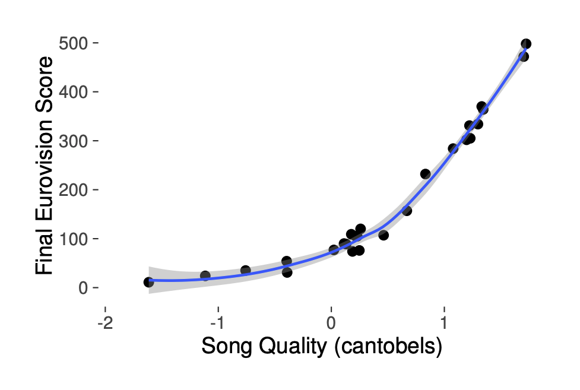
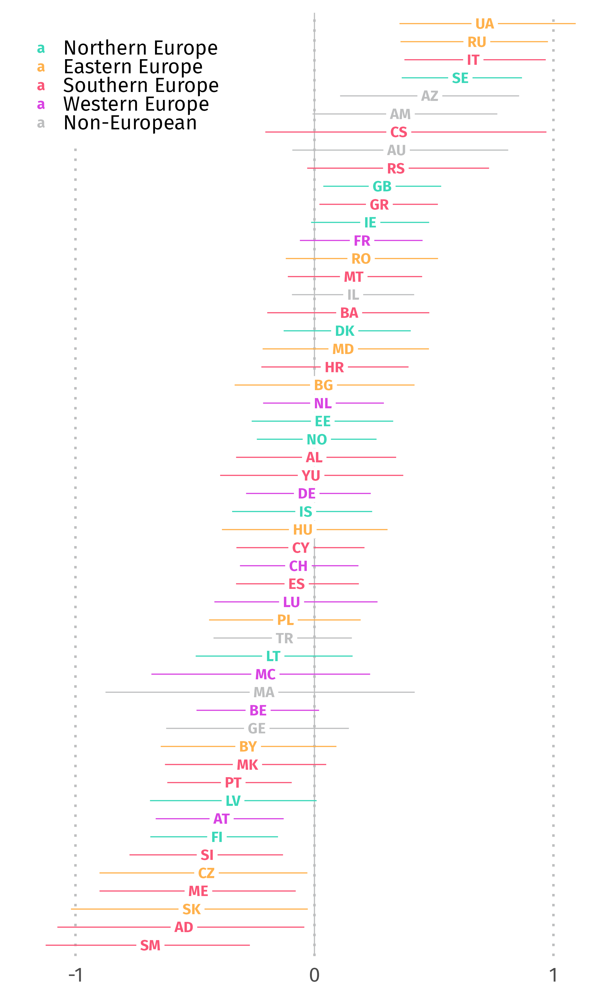
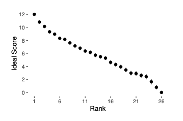

# Measuring the Eurovision Song Contest: A Living Dataset for Real-World MIR

This repository contains the materials to reproduce results reported in:

* [Measuring the Eurovision Song Contest: A Living Dataset for Real-World MIR](https://ismir2023program.ismir.net/poster_276.html)

* [Paper on ISMIR Archive](https://archives.ismir.net/ismir2023/paper/000097.pdf)

To access the repository that is used to manage and update the original dataset, please visit 

* [the eurovision-dataset repository](https://github.com/Spijkervet/eurovision-dataset).


## Data 

Data that comprises the MIRoVision dataset originates from three primary sources:

1. [Official Eurovison website](https://eurovision.tv/)
2. [Eurovision World fan website](https://eurovisionworld.com)
3. audio features taken directly from the YouTube videos.

The dataset contains five primary types of data: 

1. contest meta-data; 
2. contest results; 
3. voting data; 
4. audio features extracted from recorded performances of the musical acts and 
5. betting office data.

### Contest Meta-Data

Contest data is stored as an `.RDA` file in `data`.

### Contest Results

Contest data is stored as an `.RDA` file in `data`.

### Voting Data

The voting data is stored in three separate tables:

1. votes; 
    - contains data from the contest's beginning in 1956 and indicates how each country's aggregated jury and televoting points were distributed to each other participating country.
2. contestants; and 
    - contains all metadata regarding each song entry, such as the artist's name and song title, lyrics, composers and lyricists, the running order and the total points awarded by the jury and televoters in the Semi-Final and Final Rounds respectively. This table also includes links to YouTube videos of live performances from the televised Finals or Semi-Finals, as maintained by the Eurovision World team.
3. jurors.
    - contains data beginning from the year 2016 and indicates how the five anonymous jurors (designated with letter names A through E) voted for each other country and in which night of the contest.

### Audio Features 

To reproduce the audio features used in the paper, navigate to [the dataset repository](https://github.com/Spijkervet/eurovision-dataset) and follow the instructions under the [Audio Features](https://github.com/Spijkervet/eurovision-dataset#audio-features) heading.  

### Betting Office Data

In addition to the voting tables, the betting-offices table provide tables of historical bookmakers' odds for the contest winners, as collected by Eurovision World.
The Eurovision Song Contest is a popular target for online betting.
Day-of-contest odds are available for 2016 and 2017, and daily odds up to six months prior to the contest are available from 2018 onward, for between 10 and 20 betting offices.

## Figures

### Figure 1



Correspondence between song competitiveness (in cantobels) and final Eurovision Song Contest scores in 2019. The pattern in this year is typical of all other years, with a relatively slow increase in points as competitiveness improves up to about 0.5~cantobels, followed by a rapid increase. Because of the semi-final rounds, the relationship between competitiveness and final score is not a strictly monotonic as in years without semi-finals, but it is still nearly monotonic.

### Figure 2


Historical competitiveness of Eurovision Song Contest entries (in cantobels). Countries are coloured by their geographic region as defined in the United Nations M49 standard. Winners are boxed. The standard error of estimates is roughly 0.5 cantobel in early years and roughly 0.3 after the institution of semi-final rounds in 2004; as such, difference of approximately 1.0 cantobels are likely statistically significant. After a period when Northern and Western Europe exchanged victories, there was a period of Northern European dominance; recent years have been characterised by a good geographic diversity of winners.

### Figure 3



Median competitiveness of countries' Eurovision Song Contest entries, 1975--2022, in cantobels with 90% credible intervals.
Countries are coloured by their geographic region as defined in the United Nations M49 standard.
Ukraine, Russia, Italy, and Sweden stand out as having sent contestants of exceptional competitiveness, although Azerbaijan, the United Kingdom, and Greece's credible intervals are also strictly greater than zero.

### Figure 4



Ideal scores for averaging ranks within juries, according to a generalised partial-credit model, with 90% credible intervals. In recent years, the Eurovision Song Contest has used an exponential weighting scheme, but these results suggest that a linear scheme with a small bonus for the top-ranked entry would be sufficient.

## Modeling Code

The models used in the paper can be found under `inst/stan`. We plan to incorporate these models into an R package soon. 

## Cite

When using these materials please the following resources:

### Paper

```

@misc{burgyone_mirovision,
    author       = {John Ashley Burgoyne and Janne Spijkervet and David John Baker},
    title        = {{Measuring the Eurovision Song Contest: A Living Dataset for Real-World MIR},
    month        = nov,
    year         = 2023,
    doi          = {TBD},
    version      = {TBD},
    publisher    = {Zenodo},
    url          = {TBD}
}

```

### Dataset

```

@misc{spijkervet_eurovision,
    author       = {Janne Spijkervet},
    title        = {{The Eurovision Dataset}},
    month        = mar,
    year         = 2020,
    doi          = {10.5281/zenodo.4036457},
    version      = {1.0},
    publisher    = {Zenodo},
    url          = {https://zenodo.org/badge/latestdoi/214236225}
}

```

